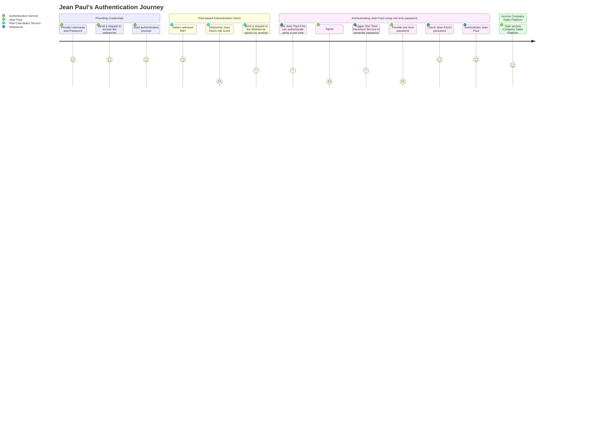
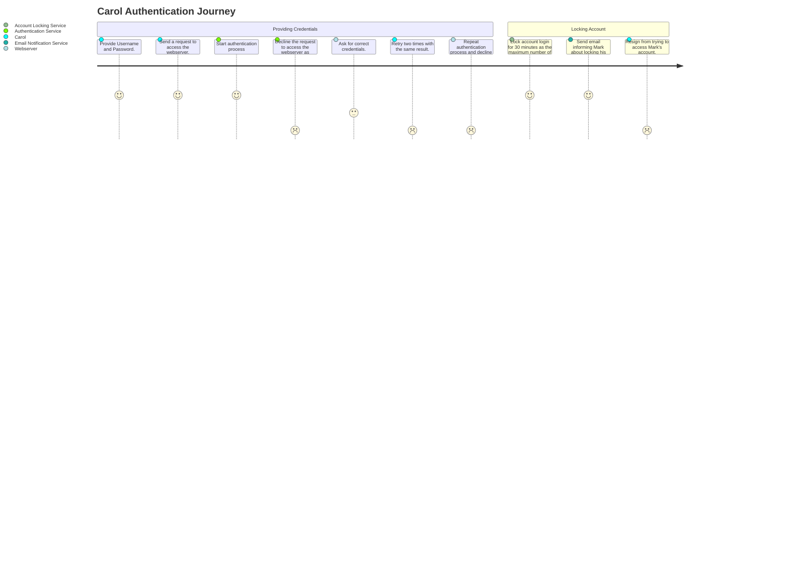

# Introduction
With more and more organizations having their systems available online, an urgent need to provide additional security mechanisms emerged. Everyday a company copes with a threat of malicious software, data breaches, which can result in user data leaks. It leads not only to financial losses, but also to much worse customer trust. That is why security policies were introduced and one of them is **user authentication**. 

User authentication is a process that allows to identify a user requesting access to a given network, system or device. It provides a way to check users' identities by using, for example, usernames and passwords, but also using other tools like biometrics (for example, fingertip scanners), or authentication apps.  

User authentication policies help to strengthen your network security. They protect your users' privacy.

There are three main tasks for the user authentication process:
- It manages the connection between the user and your website server.
- It verifies user's identity.
- It approves or declines user's authentication.

This blog post will introduce you to different authentication policies and methods. It will discuss challenges that your user must face during the process of veryfing their identity. It also explores differen authentication scenarios and provides hints how to design your user authentication journey. 

# Authentication Methods
In order to confirm their credentials, users must provide an information that only them and the server know. There are three types of such information:  
- Knowledge-based. To confirm their identity, users provide a piece of information they have in their knowledge, for example, a pin number, an username and a password. 
- Inheritance-based. Users authenticate themselves by providing their biological characteristics, like a fingerprint, or a facial scan. 
- Possession-based. A specific item allows the user to authenticate themselves. It may be, for example an ID card, or a special token that generates authentication codes. 

## Password-based Authentication Method
Password-based Authentication is probably the simplest and most common method for authenticating the user. As its name implies, to authenticate a user must provide their username and a password that only them and the server know.  

Even though password-based method is so common, it is not the safest way of user authentication. Passwords are an easy target to be hijacked and they are very often shared between many different independent systems. Compromising one of those systems may result in providing access to another one. 

## Passwordless Authentication Methods
There are three types of passwordless authentication methods:
- A biometric method.
- A certificate-based method.
- A token-based method. 

A biometric method is simply an inheritance based method that was mentioned before. A user provides a facial scan, or a fingertip scan to verify their identity.  

A certificate-based method allows the user to provide a digital certificate as a way of proving the user's identity. Such certificates are provided only by a certification authority and prove that the user has a private key in their possession. When a server receives such a certificate, it checks the certification authority and the digital signature provided (the private key). Then, it decrypts the certificate and checks the credibility of the private key.  

A token-based method provides the users with a string of random characters (a token). The users have to provide they credentials once and after that their receive their digital token. From now on, the user provides the token to the system to authenticate themselves without a need to reenter their credentials. 

## Multifactor Authentication
A Multifactor Authentication (MFA) is a method that links more than one independent method of authentication. There are multiple ways to build such authentication process. For example, the server may require providing an username, a password, and a code sent via a text message. Sometimes, the user must solve a Captcha test.  

An MFA is the safest way to authenticate a user, but it has its downsides. For example, a user may lose access to their email or phone leaving them with no access to the system. 

# Common API Authentication Methods
Main concern of a company that delivers APIs is how to secure its data. There are three major ways it is achieved:  
- **HTTP Basic Authentication**
- **API Keys**
- **OAuth**.

## HTTP Basic Authentication
One of the least recommended authentication methods is **HTTP Basic Authentication***. It is a solution most vulnerable to data breaches, as the user authenticates themselves only by providing their username and password. No other more complex processes takes place. HTTP are not encrypted in any way, therefore user data can be intercepted by malicious software and simply copied. To enhance HTTP Basic Authentication method, very often **Secure Socket Layers** (SSLs) are implemented to safeguard user's sensitive data and to protect the internet connection.

Even though, HTTP Basic Authentication is the simplest process of all mentioned, it still has its use, when a quick response time is not needed and authentication policy costs must be reduced. 

## API Keys
One of the fastest ways to authenticate your users is to use **API Keys**, which were created to solve the problems coming with HTTP Basic Authentication. Every first-time user is assigned an unique and generated value. It signifies that the user is already known by the system. Once the user tries to access the system again, their API key is used to prove that they have the same identity as before.  

The biggest downside of API Keys, is that, in theory, API Key can be picked up as easy as the network transmission. If any point in the network is insecure, it results in the entire network exposed, as the user provides the API Key only once. The risks can be mitigated by using proper authorization methods. 

## OAuth
**Authentication as authorization** is possible thanks to **Open Authorization Standard** commonly known as **OAuth**. It combines both authentication and authorization. When user logs in to the system that uses OAuth, that system requests authentication that usually is in a form of a **JSON Web Token** (JWT). The user forwards this request to an authentication server that either allows or rejects this authentication. If the server accepts the request, a token is provided to the user. Such tokens have their limitd scope, validity periods, and can be used over time. They can be also checked by the system at any time for validating the user's identity and their permission to access data. 

OAuth as an authentication policy it much more secure than solutions mentioned before. What is more, it offers much more than authentication. It also allows to delegate access to resources. Because of that, using OAuth solely for the purpose of authentication is like having a racing car and using it only for daily commuting. 

# Authentication vs. Authorization
When we talk about authentication, it is worth mentioning **authorization**. Nowadays, there is a tendency to use both terms interchangeably, but they are completely different concepts. As we have stated before, user authentication is **verifying** user's identity. Authorization is a process of verifying to which resources the user has access to. It defines if a user has all the necessary permissions that are defined to access certain data or functionality. As an example, we can use driving licenses. Your photo, name and surname, can be used to authenticate who you are, and the fact that you have your license for a certain type of automobiles authorizes you to drive, for example, a car up to 3,5 tons.  

# Continuous Risk-based Authentication
Organizations face different types of risks to protect their customer's sensitive data depending on the market the company provides they product for, the type of data they store and functionalities they provide. An online library will face much different and lower risks than a financial institution. Such different needs can be satisfied using **continuous risk-based authentication** (RBA). Such system evaluates the risk of data breaches by taking into consideration multiple factors of the profile of the agent that requests access to the system. Those factors can be IP address of the agent, their User-Agent HTTP header, login device, malware detection, and so on. 

Very often, machine authentication is used. The process of additional authentication steps is not taken until the user tries to access the system from a different machine. For example, if a user is attempting to access your system not from a device that was used before, then an additional step of sending a one time password on an autonomous and previously defined machine. Having an additional step of authentication for the user only if the attempt was made using another device is convenient for the user. 

# Authentication User Experience
Authentication policies and authentication events help to drive user authentication journey. Choosing a **right solution** with its pros and cons results in **better user experience** but also **increased security of user's sensitive data**. Any organization must choose an appropriate process to ensure its customers that their resources are safe. In addition to right policy, authentication events help not only the system by, for example, not letting someone access another person's resources, but also they can notify the user what went wrong. It results in much better user authentication journey. Authentication events differ between organizations and between different solutions.  

Let's provide an example. Your organization has chosen **Basic HTTP Authentication** as their authentication method. One of your customers attempts to verify their identity. As your authentication policy consists only of providing a username and a password, your use provides their credentials. If they are right, a `verified` event is fired and the user is successfully authenticated. If the user provides wrong credentials, there are the following options:  
- `failed` event is fired when the user provided a nonexistent email, or a wrong password.
- `locked` event is fired when the user reached out the limit of failed login attempts. This event locks the account and it can be unlocked, for example, by your system administrator after any other authentication process.  

As we can see, this solution not only results in increased security of your customer's sensitive data, but after implementing processes, it can notify the user what went wrong. All of the customers want to keep their information safe, but they also want to know what went wrong during their failed authentication attempts. On the other hand, providing such information is considered a security thread as you provide additional information to a person that tries to access other users' data.  

# Designing User Authentication Journeys
While designing successful user authentication journeys, it is crucial to remember the main purpose of authentication which is achieving a secure system that protects user's sensitive data from being compromised. For higher risk markets it is worth choosing more complex solutions with multifactor authentication, which may result with worse user experience, but with higher safety. Another important factor to consider is the target user. There is no point in delivering a complex authentication policy that utilizes, for example, API keys, if you are developing a social media platform, because very often your users will have no idea what to do with them. However, you should definitely consider it when you deliver your API to your customers.  

# User Authentication Journey Examples  
Below, you can find two simple diagrams, one of which illustrates a user authentication journey that ends with a success, whereas the other results with the user account locked. 

Jean Paul is a successful salesman, who has a lot of work travels. He tries to access his company sales platform from his clients office. His company authentication policy has multifactor authentication enabled for all employees and takes into consideration their risk score.  

You can see that Jean Paul's user experience lowered once he was asked for performing another steps of authentication. However, such solution enables a higher security level for the Company Sales Platform.  

Carol is a teenager that tries to access a social platform account of his colleague, Mark. He saw Mark typing in his credentials and is almost sure that he will be able to mess with his friend. 

Even though the authentication policy of this social platform is rather poor, Carol was not able to access Mark's account. A simple authentication method prevented Carol from gaining access to Mark's personal data.

# Challenges for Your Users
Growing risks for organizations leads to implementing new and complex authentication policies or methods. Unfortunately, there is no option that one solution fits everyone and every company must strive to deliver as good and as well designed customer experience. For example, a person working in sales, travelling between offices, and basically, having bigger risks of data breaches, will find machine authentication a nuisance, whereas a software developer working only from one office will not have a problem with that at all. There are many challenges that you must take into consideration while designing your authentication policy and how you can counteract.  

## Password Vulnerability Challenges
Systems that use only an username and a password try to make it more difficult for an unauthenticated person to access other people sensitive data. That leads to, for example, requiring special characters or numbers added to the password. It is also best practice for the users not to share the same password between different systems as compromising one can lead to giving access to the others. Remembering many different and complex passwords may become a struggle for people and the moment this becomes a nuisance for them, it also presents much higher risk of a data breach.  

## Enabling Multifactor Authentication
Any additional step that the user must take to access the system becomes an extra effort that, in fact, not many people want to take. Again, organizations should invest time into educating people that this one additional step will result in much more likelihood of their data to be breached. 

## Phishing
Organizations may improve their security solutions, but there is always a side they do not have control on- a social side. People around the world are target of phishing emails or SMS spoofing. Hackers often try to send messages that resemble official communication from the organization the user puts their trust in. It can be their bank trying to contact them, their system administrator, employer, and so on. 

## How to Counteract
The only solution to all of the challenges the users face while authentication is educating people of importance of their personal data, resources, and the safety of their user accounts. People must see the risk of their information to be breached and the threats that may pose. Organizations should invest their time into making presentations, educational campaigns, phishing quizzes, and other means of education. 

# Wrap Up
Strong authentication policies and user journeys are the safeguard of your customer's sensitive data. Choose the right methods and authentication events that suit your needs best and design a journey that is not only secure, but also results in a good user experience tailored to your target customers. 
